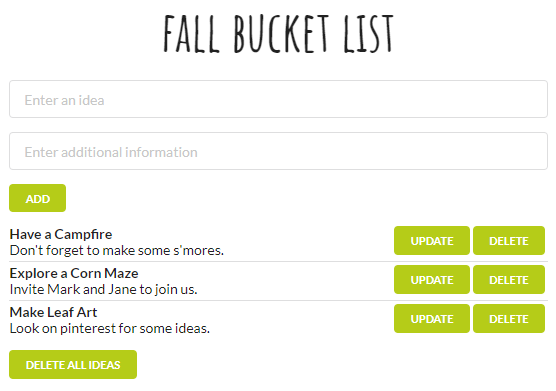

## Fall bucket list app

I built this project in order to practice using Firebase with React.

Using this app you can:
- see a list of ideas
- add a new idea
- update idea
- delete idea
- delete all ideas

#### Install & Start

    $ git clone https://github.com/orvalho/fall-bucket-list
    $ cd fall-bucket-list
    $ npm install
    $ npm start

#### App

#### Stack

-   react
-   react-dom
-   re-base
-   firebase
-   semantic ui